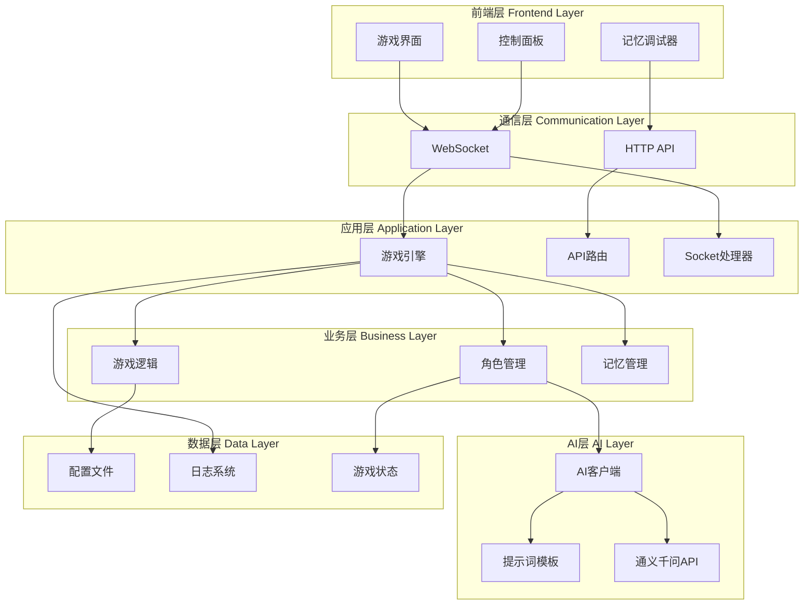
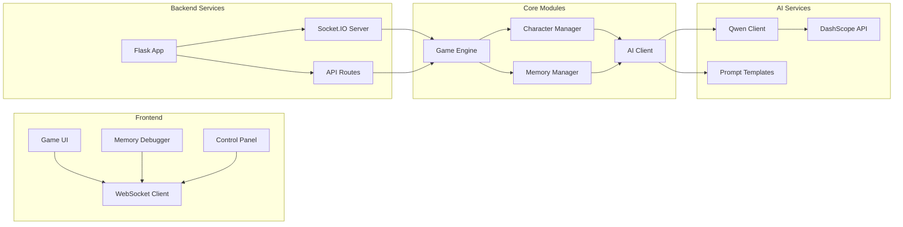
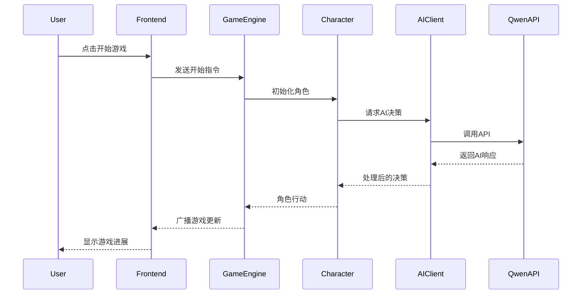
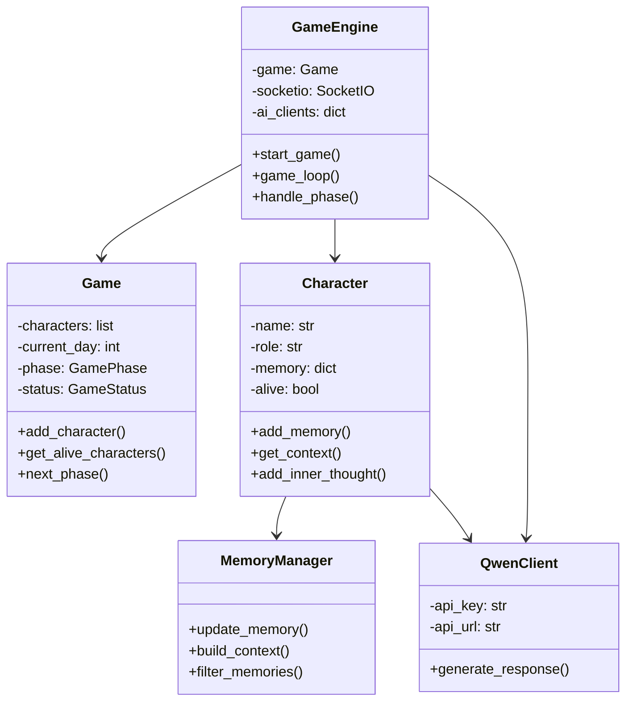
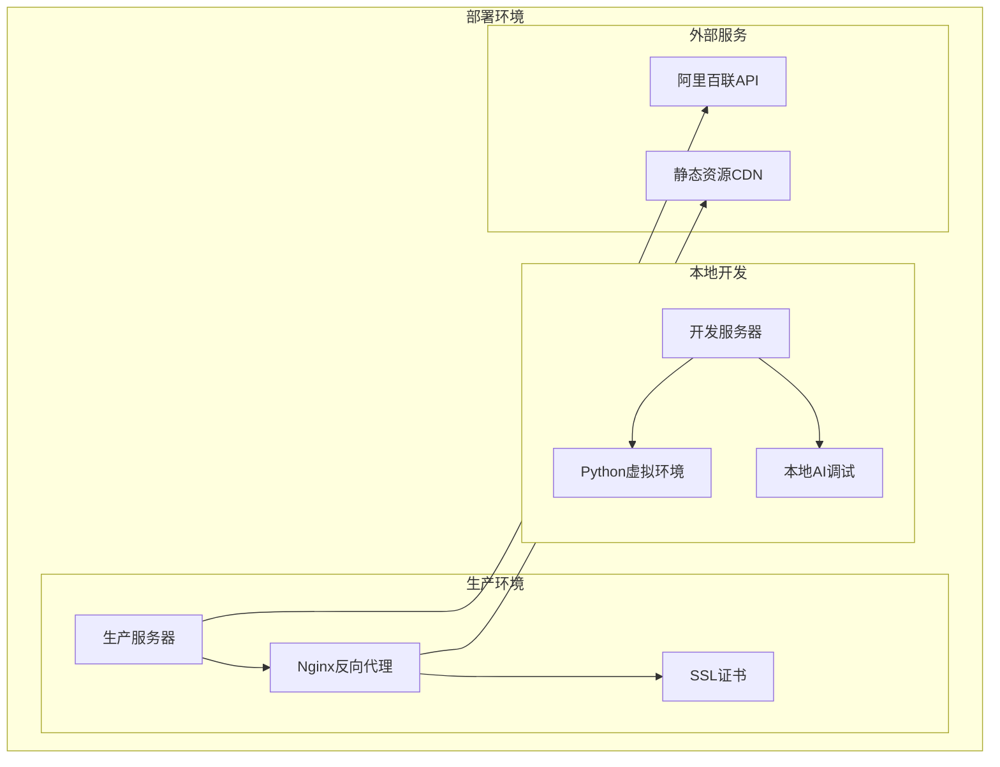

# 狼人杀模拟器 - 技术架构图

## 整体架构概览

## 模块依赖关系

## 数据流图

## 核心类关系图

## 技术栈详情

### 后端技术栈
- **Python 3.9+**: 主要开发语言
- **Flask**: Web框架
- **Socket.IO**: 实时通信
- **Requests**: HTTP客户端
- **Threading**: 多线程处理
- **JSON**: 数据格式
- **Datetime**: 时间处理

### 前端技术栈
- **HTML5**: 页面结构
- **CSS3**: 样式设计
- **JavaScript (ES6+)**: 交互逻辑
- **Socket.IO Client**: 实时通信
- **Fetch API**: HTTP请求

### AI服务
- **阿里百联 DashScope**: AI服务平台
- **通义千问-Turbo-Latest**: 语言模型
- **自定义提示词工程**: 角色扮演优化

### 开发工具
- **Git**: 版本控制
- **Python venv**: 虚拟环境
- **dotenv**: 环境变量管理
- **Markdown**: 文档编写

## 部署架构

## 性能指标

### 系统性能要求
- **响应时间**: API调用 < 3秒
- **并发支持**: 单实例支持10个并发游戏
- **内存使用**: < 512MB
- **CPU使用**: < 50%

### AI服务性能
- **AI响应时间**: < 5秒
- **API成功率**: > 95%
- **降级响应时间**: < 100ms
- **内容质量**: 角色一致性 > 90%

## 安全考虑

### API安全
- API密钥环境变量存储
- 请求频率限制
- 错误信息脱敏
- 日志敏感信息过滤

### 数据安全
- 内存数据定期清理
- 用户输入验证
- XSS防护
- CSRF保护

---

*本文档随项目开发持续更新*
